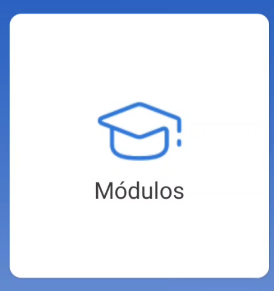
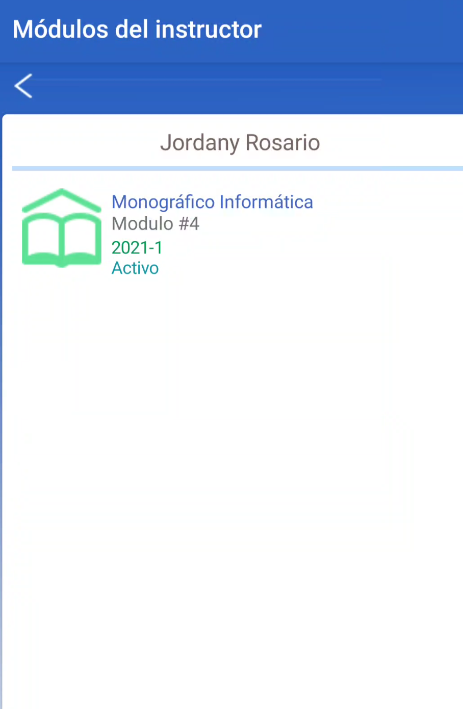
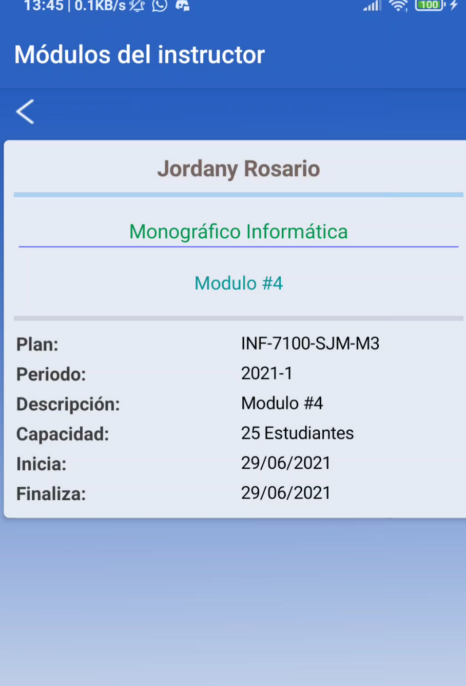

# Facilitador

Funcionalidades disponibles:

- detalles de monográficos y módulos asignados

- publicar calificaciones

- ver calificaciones

## Módulos

### **Ver monográficos asignados**

**1. En la pantalla de inicio selececione módulos:**

---

 

**2. Selecionar el monográficos del cual desea ver el modulo asignado:**

 

 

**3. Luego podra ver los detalles de el modulo asignado:***

 

