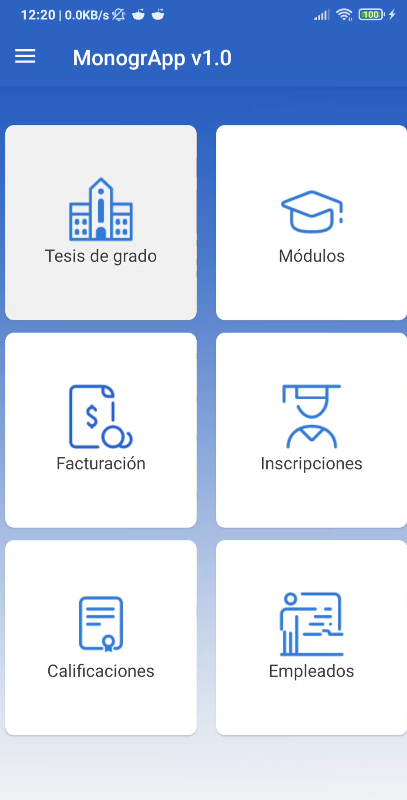
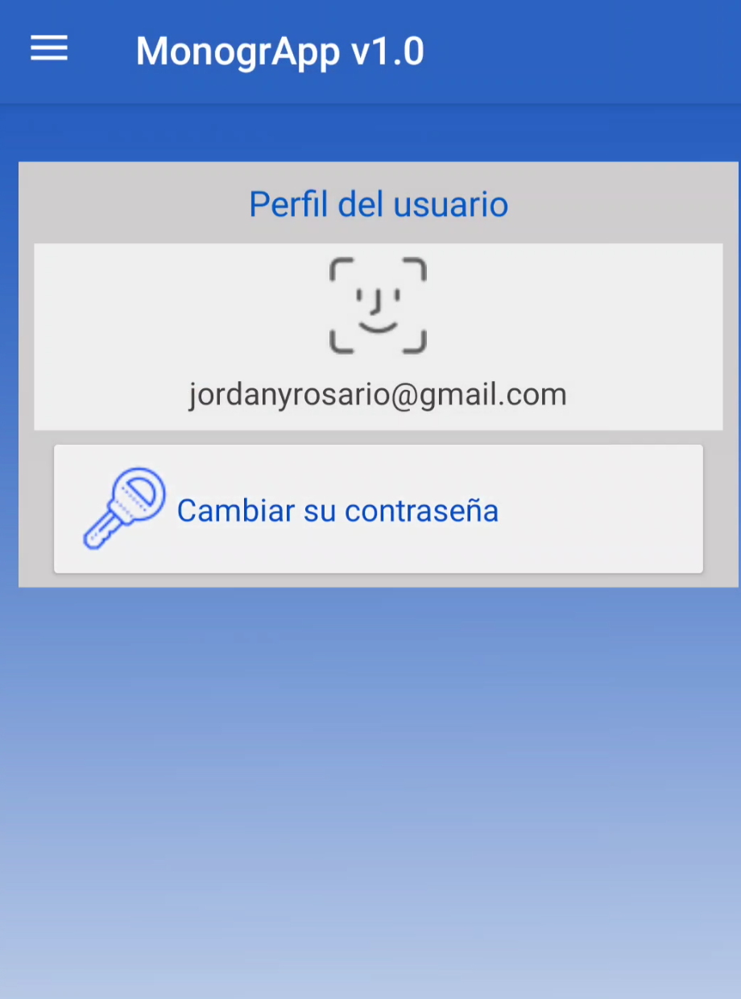
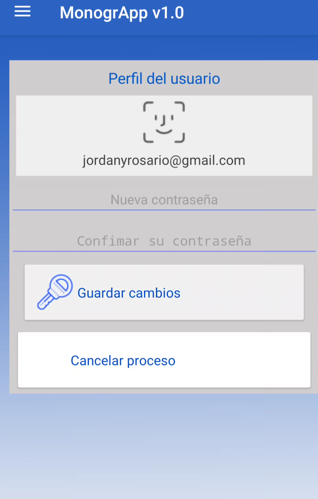

# Perfil

## Cambiar contraseña

1. En la  esquina superior derecha haga click par **abrir el menu principal:**

 

---

 

2. Selecione  el **Menu Perfil**

 

 

3. hacer click en el boton **Cambiar su contraseña**

 

 

4. **Introdusca la nueva contraseña** en el primer campo y la **contraseña actual** en el segundo campo

 

 

5. Para completar el proceso hacer click en **Guardar cambios**

 
