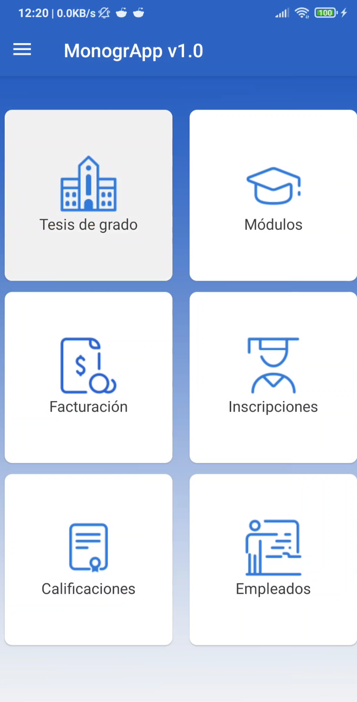

# Monograppp

## Login

 ---
Para poder iniciar session debe poseer credenciales de acceso, en caso de no contar con esta debe contactar al administrador

## Inicio de session

---

- **Primer campo** debe colocar el correo previamente habilitado.

- **Segundo Campo** debe colocar su contraseña.

- **Tercero** hacer click en iniciar session.

## Login exitos

---

## Login invalido o intento fallido

---

---

Asegúrese de haber introducido la contraseña correcta. En caso contrario intente recuperar la contraseña via web o contacte al administrador.
